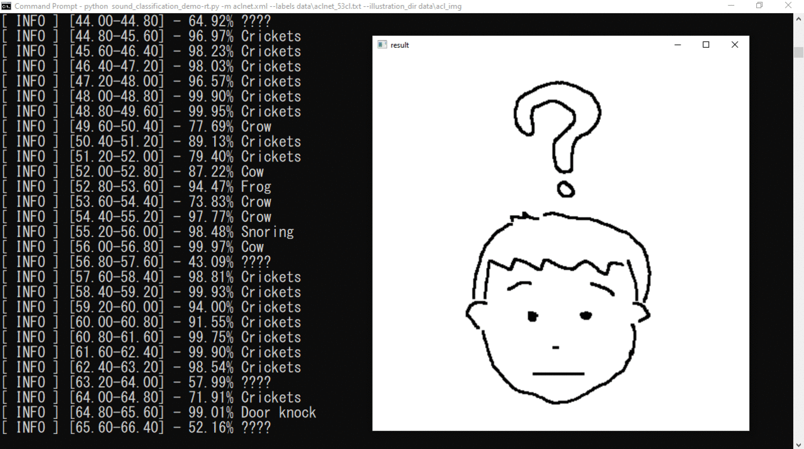

# Real-time version of 'sound_classification_demo.py'

### Description:  
This is a real-time version of `sound_classificatioin_demo` in the OpenVINO toolkit. The original demo takes an audio file and show the classification result to the console. I modified the demo program. Now the demo program can capture audio stream from microphone and show the classified result on the display with illustration in real-time.  
OpenVINO付属の`sound_classification_demo`を改造してリアルタイム版にしたデモです。オリジナルのデモはフィルから音声データを読み込み、推論結果を画面に表示するものでした。これを改造し、マイクから音声を読み込み、リアルタイムに分類し、結果を(ヘタクソな)イラストとともに画面に表示するようにしました。  



### Prerequisites:

- OpenVINO 2021.4
- Python modules: `pyaudio`, `numpy`, `opencv-python`


### How to run:  

1. Install Intel OpenVINO toolkit 2021.4  
[Download](https://software.intel.com/content/www/us/en/develop/tools/openvino-toolkit/download.html)  
[Get Started Guide](https://docs.openvinotoolkit.org/latest/get_started_guides.html)  

2. Install Python prerequisites  
```sh
python -m pip install --upgrade pip setuptools
python -m pip install -r requirements.in
```

3. Download required DL models
```sh
python %INTEL_OPENVINO_DIR%\deployment_tools\open_model_zoo\tools\downloader\downloader.py ^
 --list models.lst
python %INTEL_OPENVINO_DIR%\deployment_tools\open_model_zoo\tools\downloader\converter.py ^
 --list models.lst --precisions FP16
```

4. Run the demo

```sh
python sound_classification_demo-rt.py ^
 -m aclnet.xml ^
 --labels .\data\aclnet_53cl.txt ^
 --illustration_dir .\data\acl_img
```

### Note:  
Tested on OpenVINO 2021.4 (Win10)
